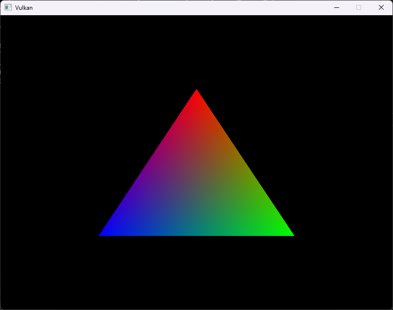

# VulkanHelloTriangle
A basic triangle in Vulkan. Made to show the complexity and explicitness of the Vulkan API. Based on the [vulkan tutorial](https://vulkan-tutorial.com/)

You should change the CMakeLists.txt for your Vulkan SDK and GLFW binary location. 

